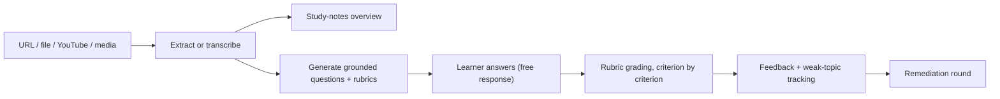

# Recall — an adaptive active-recall tutor

Recall turns lectures, papers, videos, and documents into **free-response
practice with rubric-grounded AI feedback**. Paste a URL, a YouTube link, or a
media file — or upload a PDF/DOCX/TXT — and Recall extracts the content,
generates medium-difficulty questions grounded in specific source passages,
grades your written answers **criterion by criterion** (not by exact-wording
match), and then targets your weakest topics for another round.

**Live demo:** <https://recall-tutor.onrender.com>

### Highlights

- **Multimodal ingestion** — web pages, PDF/DOCX/TXT, YouTube transcripts, and
  audio/video via speech-to-text.
- **Structured LLM outputs** — questions and grades come back as schema-validated
  JSON, not fragile hand-parsed text.
- **Criterion-level rubric grading** — each answer is scored per rubric criterion
  with cited evidence, so valid paraphrases get credit and unsupported claims are
  flagged.
- **Source-grounded questions** — every question stores the passage it came from.
- **Personalized remediation** — weakest topics drive the next practice round.
- **Local-first, optional cloud sync** — works with zero backend; optional GitHub
  sign-in + Neon Postgres syncs History across devices.
- **Production hygiene** — SSRF protection, per-IP rate limiting, security
  headers, a unit-test suite, and CI.

### Pipeline



Built with Next.js (App Router) + TypeScript + Tailwind and the Claude API.
**Local-first by default** — sessions live in the browser's `localStorage`;
GitHub sign-in and Postgres sync are optional (see [Cloud sync](#cloud-sync-optional--accounts--cross-device-history)).

## Setup

1. Install dependencies (already done if you're reading this after scaffolding):

   ```bash
   npm install
   ```

2. Add your Anthropic API key. Copy the example env file and paste your key:

   ```bash
   cp .env.local.example .env.local
   ```

   Then edit `.env.local` and set `ANTHROPIC_API_KEY`. Get a key at
   <https://console.anthropic.com/settings/keys>. The key stays on your machine —
   it's only read server-side by the API routes.

3. Run the dev server:

   ```bash
   npm run dev
   ```

   Open <http://localhost:3000> (or the port shown in the terminal).

## How it works

- `app/api/extract` — pulls clean text from a URL (Readability) or a file
  (`unpdf` for PDF, `mammoth` for DOCX, plain text for TXT/MD).
- `app/api/generate` — one Claude call returns questions, each with a topic,
  a reference answer, a **rubric** (criteria summing to 10 points), and the
  supporting source passage. Uses structured outputs so the JSON is always valid.
- `app/api/grade` — grades a free-text answer against that rubric criterion by
  criterion (not against one exact answer), so valid alternative wording gets
  credit.
- **Long sources** — documents beyond ~58k characters are chunked by structure
  (`lib/chunk.ts`) and a diverse, **whole-document-spanning** subset is selected,
  so questions cover the *end* of a textbook or paper, not just the start.
  (Dependency-free coverage selection; embeddings-based semantic clustering is a
  planned enhancement.)

## YouTube videos

Paste a YouTube link as a source and the app studies the video's **transcript**.
YouTube blocks free server-side caption scraping (proof-of-origin tokens), so
this uses a managed transcript API: set `SUPADATA_API_KEY` (free tier at
<https://supadata.ai>). Without it, YouTube links show a "not set up yet"
message. The provider call is isolated in `lib/youtube.ts` (`fetchTranscriptText`)
so you can swap providers.

## Audio & video (transcription)

Upload an audio/video file, or paste a **direct media URL** (`.mp4`, `.mp3`,
`.m4a`, `.mov`, a podcast link, …), and the app transcribes the speech and
studies that. Uses **Deepgram** (set `DEEPGRAM_API_KEY`, free credit at
<https://deepgram.com>) — one synchronous call that accepts a URL (Deepgram
fetches it) or the uploaded bytes, so the server never stores large media.
Provider is isolated in `lib/transcribe.ts`. Without the key, media sources show
a "not set up yet" message.

Limits: uploads are capped at 60 MB (paste a URL for larger); very long media can
exceed the request timeout — an async job flow is the planned upgrade for that.
Note this is separate from YouTube, which uses the caption/transcript API above.

## Model

Defaults to `claude-opus-4-8` (highest quality). To trade quality for lower cost,
set `ANTHROPIC_MODEL` in `.env.local` to `claude-sonnet-5` or `claude-haiku-4-5`.

## Deploy to Render

This repo includes a `render.yaml` blueprint that runs the app as a Node web
service (needed because the API routes run server-side).

1. Push this repo to GitHub.
2. In the [Render dashboard](https://dashboard.render.com): **New +** →
   **Blueprint**, and connect this repo. Render reads `render.yaml` and proposes
   a web service named `recall-tutor`.
3. When prompted, set the `ANTHROPIC_API_KEY` secret (it is never stored in the
   repo).
4. **Apply.** Render builds with `npm ci && npm run build` and starts with
   `npm start`. You'll get a URL like `recall-tutor.onrender.com`.

Note: Render's free tier sleeps after ~15 min idle (first request then takes
~30–50s) and has 512 MB RAM; large PDF/URL parsing can be memory-heavy, so bump
to a paid instance if you hit out-of-memory errors.

## Cloud sync (optional) — accounts + cross-device history

By default, History is stored locally in your browser. You can optionally enable
sign-in so History/groups sync across devices, backed by **Neon** (Postgres) and
**Auth.js (NextAuth)** with GitHub sign-in. The app runs fine without any of
this — it only turns on when all the env vars below are set.

1. **Neon** — create a project at [neon.tech](https://neon.tech), then copy the
   **pooled** connection string (Connect → "Pooled connection") into
   `DATABASE_URL`.

2. **GitHub OAuth app** — [github.com/settings/developers](https://github.com/settings/developers)
   → New OAuth App. Set the **Authorization callback URL** to
   `https://YOUR-SITE/api/auth/callback/github` (and `http://localhost:3000/...`
   for local dev). Copy the client id/secret into `AUTH_GITHUB_ID` /
   `AUTH_GITHUB_SECRET`.

3. **Secrets** — generate `AUTH_SECRET` with `openssl rand -base64 33`. Set all
   of these (see `.env.local.example`):
   `DATABASE_URL`, `AUTH_SECRET`, `AUTH_GITHUB_ID`, `AUTH_GITHUB_SECRET`,
   `NEXT_PUBLIC_AUTH_ENABLED=true`, and (on Render) `AUTH_URL=https://YOUR-SITE`.

4. **Create the tables** — with `DATABASE_URL` set, run:

   ```bash
   npm run db:push
   ```

5. Restart / redeploy. A **Sign in to sync** button appears; after signing in,
   your local History is pushed up and thereafter syncs across devices.

> Set **all** the auth env vars together. Enabling only
> `NEXT_PUBLIC_AUTH_ENABLED` without the backend secrets will show sign-in but
> log a server-configuration error until the rest are set.

## Testing & CI

```bash
npm test        # Vitest unit tests (rubric normalization, URL/media parsing, mastery)
npm run build   # also type-checks the whole project
```

GitHub Actions runs the tests and build on every push/PR (`.github/workflows/ci.yml`).

**Grading evaluation.** A harness in [`eval/`](eval/README.md) measures how well
the rubric grader agrees with human grades — MAE, quadratic weighted kappa,
criterion-level precision/recall, score variance across runs, and a comparison
against a reference-answer-only baseline. Label a dataset, then
`npm run eval && npm run eval:report`. (Results are only as real as the labels
you provide — no numbers are published here until they're measured.)

## Roadmap

Shipped: optional Neon Postgres + Auth.js cross-device sync; YouTube transcripts;
audio/video transcription (Phase 1 — see
[`docs/video-transcription-plan.md`](docs/video-transcription-plan.md));
concept-mastery learner model + SM-2 spaced repetition (Progress dashboard);
long-document handling (structure-aware chunking + whole-document coverage
selection, replacing first-60k truncation).

Next:

- **Semantic retrieval** — embeddings-based clustering for even better coverage
  on unstructured sources (current selection is structure/position-based and
  dependency-free).
- **Grading evaluation** — a hand-labeled benchmark comparing rubric grading to
  human grades (measured, not invented numbers).
- **Per-question adaptive selection** driven by the mastery profile, and
  streaming pipeline stages.
- **Durable background jobs** for long media (transcription Phase 2).
